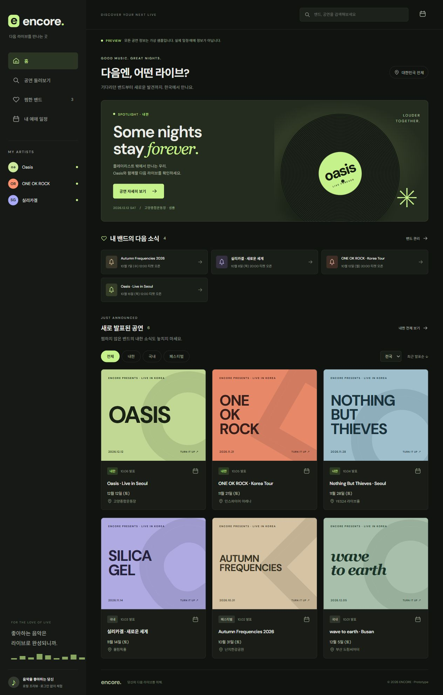

<div align="center">

# encore.

### 좋아하는 밴드의 다음 한국 공연을 만나는 곳

국내 공연부터 내한 콘서트, 페스티벌 출연까지.<br>
밴드를 찜하고 공연 소식과 예매 일정을 한곳에서 확인하는 모바일 대응 웹앱입니다.


[](https://github.com/yeonguk0201/Concert_finder/actions/workflows/ci.yml)

[빠른 시작](#빠른-시작) · [개발 로드맵](docs/development-roadmap.md) · [Supabase 설정](docs/backend-setup.md) · [기여 가이드](CONTRIBUTING.md)

</div>

---

## 우리가 만드는 경험

**공식 공연 정보 자동 수집 → 신규·변경 정보 검수 → DB 공개 → 열린 앱에 실시간 반영**이 핵심 목표입니다. 관심 밴드의 소식과 일반 예매 일정을 연결하고, 동의한 사용자에게 알림을 전달하는 서비스로 확장합니다.

현재는 이메일 로그인, 계정별 찜·예매 일정 저장과 공식 출처를 연결한 공연 탐색까지 구현했습니다. 자동 수집과 실시간 화면 갱신, 푸시 발송은 아직 구현하지 않았습니다. 관리자 직접 등록은 검수·오류 수정·누락 보완을 위한 경로로 준비합니다.

## 현재 기능

| 기능 | 현재 제공하는 동작 |
| --- | --- |
| 공연 탐색 | 밴드·공연·공연장 검색, 국내·내한·페스티벌 분류, 지역 필터 |
| 밴드 찜 | 공식 이름·한글 별칭·약칭 검색, 공연이 없는 밴드도 찜 가능 |
| 이메일 로그인 | 로그인 링크, 새로고침 세션 유지, 로그아웃, 만료 링크·발송 제한 안내 |
| 계정별 저장 | 찜·일정 서버 저장, 다른 계정과 격리, 다른 기기에서 다시 불러오기 |
| 공연 상세 | 날짜·장소·가격·일반 예매 시각, 공식 출처와 예매처 링크 |
| 내 예매 일정 | 저장·해제·목록 조회, 확인된 예매 시각의 `.ics` 캘린더 다운로드 |
| 접근 권한 | 공개 전 공연 비노출, 본인 저장만 접근, 일반 사용자의 카탈로그 변경 차단 |
| 실패 처리 | 저장 실패 시 기존 상태 유지, 재시도, 계정 전환 시 이전 데이터 제거 |

> **일정 저장은 티켓 구매나 푸시 알림 예약이 아닙니다.** 미확인 정보는 미정으로 표시하고, 시각이 미정이면 캘린더 다운로드를 비활성화합니다. 다른 기기 변경은 현재 새로고침 또는 ‘다시 불러오기’로 확인합니다.

<details>
<summary>초기 프리뷰 화면 보기 · 가상 샘플</summary>



초기 UI 기록입니다. 이 이미지의 공연·라인업·가격·장소 조합은 가상 샘플이며, 현재 계정 모드의 실제 데이터 화면과 다릅니다.

</details>

## 빠른 시작

Node.js **24**를 기준으로 개발·CI를 검증합니다.

```sh
git clone https://github.com/yeonguk0201/Concert_finder.git
cd Concert_finder
npm ci
npm run dev
```

개발 서버: `http://localhost:5173`

### 두 가지 실행 모드

| 모드 | 설정 | 데이터와 저장 |
| --- | --- | --- |
| 로컬 프리뷰 | Supabase 환경변수 두 값이 모두 비어 있음 | 가상 샘플 + 현재 브라우저의 localStorage |
| 계정 모드 | Supabase URL과 공개용 키 설정 | Supabase 공개 카탈로그 + 로그인 계정의 서버 저장 |

프리뷰의 모든 공연 정보는 `src/data.ts`에 있는 **가상 샘플**입니다. 화면과 캘린더 파일에 샘플 표시를 유지하며, 실제 계정으로 샘플 찜·일정을 자동 이전하지 않습니다. 계정 모드에서 조회 실패가 발생해도 샘플 데이터로 대체하지 않습니다.

### Supabase 연결

1. **신규·빈 프로젝트**의 SQL Editor에서 [초기 마이그레이션](supabase/migrations/202610060001_initial.sql)을 실행합니다. 기존 프로젝트에는 구조·충돌 확인 없이 적용하지 않습니다.
2. `.env.example`을 `.env`로 복사하고 아래 두 값을 넣습니다.
3. Auth의 Site URL·Redirect URLs에 개발 서버 주소를 등록하고 이메일 로그인을 준비합니다.
4. 개발 서버를 재시작합니다. 밴드·공연이 없는 프로젝트에는 빈 목록이 표시됩니다.

```dotenv
VITE_SUPABASE_URL=https://YOUR_PROJECT.supabase.co
VITE_SUPABASE_PUBLISHABLE_KEY=YOUR_PUBLISHABLE_KEY
```

**service_role·secret key·DB 비밀번호는 브라우저 코드와 `VITE_` 변수에 넣지 않습니다.** `.env`는 Git에 포함하지 않습니다.

설정·SMTP 점검·실제 계정 검증은 [Supabase 연결 안내](docs/backend-setup.md)에 정리했습니다. 검증한 실제 밴드·공연의 초기 등록 SQL은 [supabase/manual](supabase/manual)에 있습니다. 일반 예매가 이미 열린 공연은 과거 오픈일을 유지하며 새 예매 오픈으로 표시하지 않습니다.

## 구조

```text
src/
  App.tsx                화면·탐색·상세·저장 동작
  backend.ts             Supabase 클라이언트
  useAuth.ts             이메일 로그인·세션
  useCatalog.ts          공개 카탈로그 조회
  catalog.ts             서버 응답을 화면 데이터로 변환
  accountApi.ts          계정 찜·일정 API
  useAccountStorage.ts   저장 상태·경합·실패 복구
  data.ts                로컬 프리뷰용 가상 샘플
supabase/
  migrations/            스키마·RLS·공개 조건
  manual/                초기 등록·권한 검증 SQL
tests/                   DB·인증·저장·화면 회귀 테스트
```

React + TypeScript와 Vite로 UI를 구성하고, Supabase Auth·PostgreSQL·RLS로 로그인과 데이터 접근을 관리합니다. CSS·SVG·타이포그래피 포스터로 화면을 구성하며 실제 공연 사진을 임의로 사용하지 않습니다.

## 검증

```sh
npm test
npm run lint
npm run build
```

2026-10-06 기준 **23개 테스트**와 lint·build를 통과했습니다.

- **DB 통합:** PGlite PostgreSQL에서 마이그레이션, 공개 조건, RLS, 계정 격리·관리자 제한, 재등록·삭제 동작 검증.
- **프런트엔드:** 인증 오류·세션, 일대일 예매 응답, 계정 전환·경합, 저장 실패와 복구, 샘플 분리 검증.
- **실제 연결:** 공개 카탈로그·예매 관계 조회와 데스크톱·390px 모바일 상세·검색·저장 버튼 확인.
- **사용자 확인:** 이메일 로그인·로그아웃·세션·오류 복구, 계정별 찜·예매 일정 유지·해제·격리·다기기 반영.

네트워크 실패는 실제 Supabase SDK/API/저장 hook의 `fetch` 단계에 오류를 주입해 검증했습니다. 실제 로그인 브라우저의 오프라인 전환이나 원격 서버 장애 검증과 구분합니다. GitHub Actions에서도 테스트·lint·build를 실행합니다.

## 다음 핵심 작업

- [ ] 관리자 검수·공개·수정 화면과 변경 이력 연결
- [ ] 최소 한 공식 출처의 반복 자동 수집, 중복 판별·변경 감지·실패 추적
- [ ] DB 변경의 실시간 화면 반영, 연결 복구·계정 전환 검증
- [ ] 알림 동의·기기 관리, 신규 소식·예매 전 알림 및 실제 수신 검증
- [ ] 테스트 배포, 운영 안내·계정 삭제, 사용자 피드백과 베타 공개

**10월 19일 베타 · 10월 26일 1차 완성**은 목표 일정입니다. 자동 수집과 DB 실시간 반영을 베타 필수 조건으로 두며, 실제 구현·검증 상태에 따라 일정을 조정합니다.

| 문서 | 내용 |
| --- | --- |
| [제품 요구사항](docs/product-requirements.md) | 사용자 흐름, 데이터·알림 정책, 완료 기준 |
| [개발 로드맵](docs/development-roadmap.md) | 일정, 핵심 목표, 진행 기록 |
| [개발 작업 목록](docs/development-backlog.md) | 작업 ID, 의존 관계, 상태 |
| [Supabase 연결 안내](docs/backend-setup.md) | 설정, 수동 SQL, 실제 검증·제약 |
| [기여 가이드](CONTRIBUTING.md) | 커밋, 검증, PR 규칙 |

## 브랜치 흐름

`작업 브랜치 → dev PR → main 출시 PR`

`dev`는 개발 통합, `main`은 출시 통합 브랜치입니다. 완료하고 검증한 논리적 변경마다 커밋하며, 병합과 배포는 별도로 확인합니다. 모든 텍스트 파일은 UTF-8로 읽고 저장합니다.
